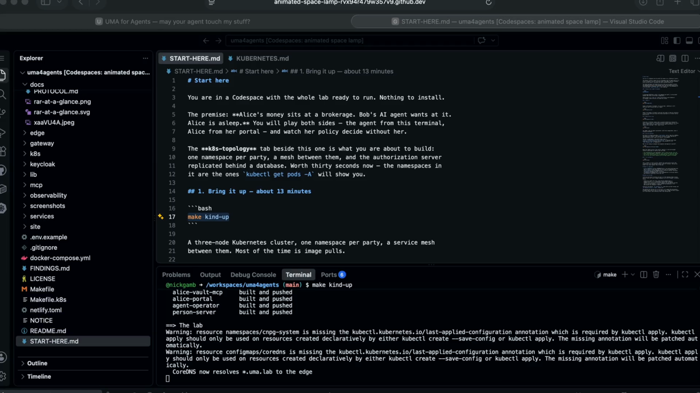

# Start here

You are in a Codespace with the whole lab ready to run. Nothing to install.

The premise: **Alice's money sits at a brokerage. Bob's AI agent wants at it.
Alice is asleep.** You will play both sides — the agent from this terminal,
Alice from her portal — and watch her policy decide without her.

## Watch it first, if you like

[](screenshots/codespace-demo.mp4)

Two and a half minutes of exactly what follows. *(Click through for the
video — GitHub only plays videos it hosts itself, so from the repo page this
is a still that opens the file.)*

---

The **k8s-topology** tab beside this one is what you are about to build:
one namespace per party, a mesh between them, and the authorization server
replicated behind a database. Worth thirty seconds now — the namespaces in
it are the ones `kubectl get pods -A` will show you.

## 1. Bring it up — about 13 minutes

```bash
make kind-up
```

A three-node Kubernetes cluster, one namespace per party, a service mesh
between them. Most of the time is image pulls.

Notice there is no `make init` and no certificate on your machine —
cert-manager issues the lab's CA inside the cluster.

## 2. Open Alice's portal and sign in

Do this before running anything else — the whole point is watching her decide,
and you cannot watch if you are not looking.

Her portal is already published; `make kind-up` did it. Open the **PORTS** tab
beside this terminal, find **Alice's portal** on 9010, and use its
open-in-browser action. Sign in as **alice / alice-demo**.

The URL is predictable if you would rather type it:
`https://<codespace-name>-9010.app.github.dev`. If the port ever stops
answering — a rollout replaces the pod the forward was attached to — run
`make codespaces-web` to republish it.

> The forwarded ports stay **private**, which is what you want: this lab ships
> fixed development credentials, and a public port would put them on the
> internet behind nothing but an unguessable URL. Private ports open fine in
> your own browser because you are already signed in to GitHub.

Keep that tab where you can see it.

## 3. Let the agent in — approve the connection

```bash
make k8s-demo-all ACT=tier1 SIM=0
```

Bob's agent asks for Alice's holdings. Her terms would permit that on their
own, but this agent has **no standing relationship with her yet**, and a
first contact pends regardless of how permissive the tier is. Nothing about
the request is wrong; she has simply never met it.

**Go to her portal and approve it.** Then watch the terminal: the agent was
holding its ticket the whole time, and the grant is issued the moment she
taps.

That connection is now standing. The next request from this agent will not
ask her again — which is exactly what makes the next step mean something.

> `SIM=0` leaves the tap to you. `SIM=1` taps for you and is how the headless
> runs work, but it also means nothing ever appears in her portal.
>
> **Do not leave it sitting.** The agent gives up after a couple of minutes
> and the run ends with `grant denied: timed out waiting for the owner` —
> which is correct behaviour, not a failure, but it is not what you came to
> see.

## 4. Now the one she has to answer for — a trade

```bash
make k8s-demo-all ACT=tier3 SIM=0
```

Same agent, same standing connection, and this time she is asked anyway.
Her policy puts trades on an ask-me tier: the connection got the agent
through the door, and it still cannot move her money without her.

Approve it in the portal, and notice what the agent receives — a grant
**bound to that one order**. Not "may trade". The epilogue in the terminal
proves it by replaying the same token and being refused.

## 5. Read what actually happened

```bash
make k8s-audit
```

The ledger, in three columns: what the agent **promised** (the signed terms,
hash and all), what Alice **personally approved**, and what was actually
**touched** — every row correlated by its negotiation id.

> Reading raw pod logs instead will mislead you. The authorization server
> runs **three replicas**, so `kubectl logs deploy/uma-as` shows one of them
> and the events of a single negotiation are spread across all three. The
> audit target is a projection over the whole stream, which is why it exists.

## 6. Check the boundary holds

```bash
make k8s-smoke-test     # expect 13 passed, 0 failed
make k8s-policy-test    # expect 11 passed, 0 failed
```

Eight of those eleven are **refusals**. A policy suite that only proves the
allows would pass on a cluster with no policy at all.

## 7. Try to break it

```bash
make k8s-chaos
```

Puts a request in front of Alice, deletes the authorization server that
accepted it, kills the database primary, waits for failover, then has her
answer *that same request*. Not a fresh one.

## Where to read more

- **[docs/KUBERNETES.md](docs/KUBERNETES.md)** — the same walkthrough with
  what to notice at each step, plus the five traps this deployment hit
- **[docs/PROTOCOL.md](docs/PROTOCOL.md)** — the wire contract, and where
  this profile deviates from UMA 2.0 and why
- **[FINDINGS.md](FINDINGS.md)** — the recommendations to the spec authors,
  each backed by something in here that runs

## When you are done

**Closing the browser tab does not stop it.** The Codespace keeps running
until it idles out, and a stopped Codespace still bills storage. To actually
finish:

- **Stop it** (keeps your work, stops burning compute hours) —
  Command Palette (`F1`) → *Codespaces: Stop Current Codespace*
- **Delete it** (nothing here is worth keeping; the lab rebuilds from the
  repo in thirteen minutes) — <https://github.com/codespaces> → the `...`
  menu beside this Codespace → *Delete*

From your own machine, `gh codespace list` shows what you have running, and
`gh codespace delete -c <name>` removes one.

The machine this lab asks for is a 2× tier, so it spends the free monthly
allowance about twice as fast as the smallest one — roughly 60 hours a month
on a free account. Worth deleting rather than leaving idle.
