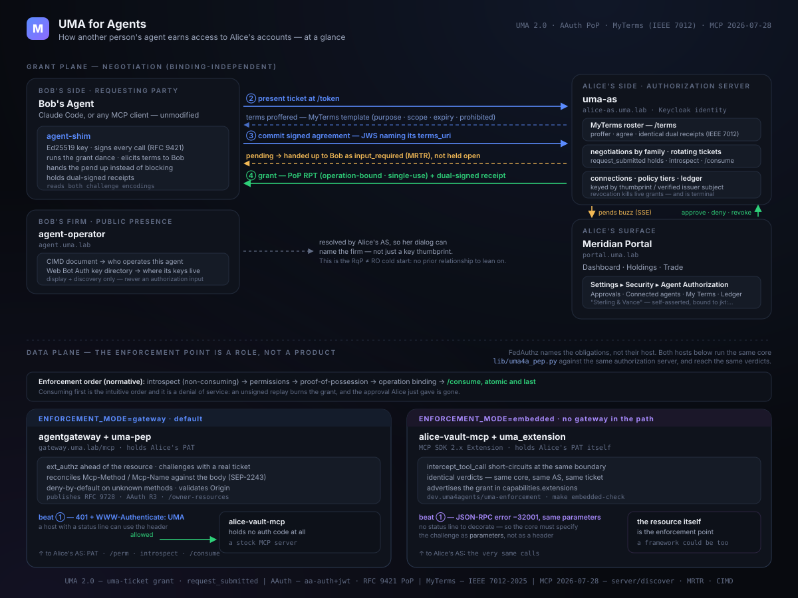

# Architecture

A reference for understanding, operating, or reimplementing the lab. The wire
contract itself — every endpoint, claim, and error — is in
[PROTOCOL.md](PROTOCOL.md); this document is the system view.



## The cast

```
┌─────────────────────────┐        ┌──────────────────────────────────────────┐
│  Bob's agent            │        │  Alice's side                            │
│  (Claude Code, or any   │        │                                          │
│   MCP client)           │        │   keycloak      identity, OIDC login     │
│        │                │ signed │   uma-as        grant loop, policy,      │
│   agent-shim  ──────────┼─ MCP ─▶│                 tickets, RPTs, ledger,   │
│   (keys, RFC 9421,      │        │                 connections              │
│    grant dance)         │        │   alice-portal  brokerage UI + the       │
└───────────┬─────────────┘        │                 agent-authorization panel│
            │                      └──────────────────────────────────────────┘
┌───────────┴─────────────┐                          ▲
│  agent-operator         │   resolved for display   │
│  Bob's firm's public    ├──────────────────────────┘
│  presence: CIMD doc +   │
│  Web Bot Auth directory │
└─────────────────────────┘

                    the resource side — one core, two hosts
                          (lib/uma4a_pep.py)                    ▲
                                                                │ PAT, /perm,
  ENFORCEMENT_MODE=gateway  (default)                           │ introspect,
  ┌────────────────────┐   ext_authz (HTTP)                     │ /consume
  │  agentgateway      │──────────▶ uma-pep ───────────────────▶│
  │  (hosts the PEP)   │            challenge · introspect ·    │
  │         │          │            PoP · scoping · consume     │
  │         ▼          │                                        │
  │  alice-vault-mcp   │  a stock MCP server; no auth code      │
  └────────────────────┘                                        │
                                                                │
  ENFORCEMENT_MODE=embedded  (no gateway in the authz path)      │
  ┌──────────────────────────────────┐                          │
  │  alice-vault-mcp + uma_extension │─────────────────────────▶│
  │  the same core, in-process       │
  │  (Extension.intercept_tool_call) │  same AS, same ticket, same
  └──────────────────────────────────┘  terms; only beat 1 differs

Supporting: person-server (the AAuth agent-identity component, for the
identified-level path; the demo default is pseudonymous keys), Grafana + Loki
+ Promtail (protocol-event observability), Envoy edge (TLS for *.uma.lab),
hickory-dns.
```

The defining split: **Alice reads and trades her own vault directly** through
her portal (she owns it). **Other people's agents** reach the same vault only
after negotiating a grant against her policy. That negotiation — not the
gateway — is the subject of this lab.

**The enforcement point is a role, not a product.** UMA 2.0's Federated
Authorization defines what a protected resource owes its owner's authorization
server (register the surface, hold a PAT, register attempted permissions,
introspect) and is deliberately silent on what discharges those obligations.
This deployment puts them in an ext_authz service behind a gateway, because
that is the shape that lets a stock MCP server participate untouched. An MCP
framework, an in-process server extension, or the resource itself could carry
the same obligations against the same authorization server and the same wire
contract — MCP SDK 2.x exposes `Extension.intercept_tool_call` for exactly
that. Read the gateway here as one host for the role; the finding is that the
role is relocatable.

## Services

| Service | Role | Language / base |
|---|---|---|
| `uma-as` | Alice's authorization server: the four-beat grant loop, tiered policy, ticket lifecycle, RPT issuance, connections, ledger, owner API, SSE | Python / FastAPI |
| `agent-operator` | Bob's firm's public presence: its CIMD document (who operates the agent) and Web Bot Auth key directory (where its keys are published). Display and discovery only — never an authorization input | Python / FastAPI |
| `uma-pep` | The enforcement core hosted as an ext_authz service (`ENFORCEMENT_MODE=gateway`): challenges, RPT introspection, proof-of-possession verification, tool→resource scoping, single-use operation binding | Python / FastAPI |
| `agentgateway` | The MCP gateway/PEP host; delegates authz to `uma-pep` via HTTP ext_authz | Solo.io agentgateway |
| `alice-vault-mcp` | Alice's brokerage vault as an MCP server (fixture data). Under `ENFORCEMENT_MODE=gateway` the protection obligations sit outside it; under `embedded` it runs the same core in-process via `uma_extension.py` | Python / MCP SDK 2.x |
| `alice-portal` | Meridian Wealth: dashboard, holdings, trade, and Settings → Security → Agent Authorization | Python / FastAPI + vanilla SPA |
| `keycloak` | Alice's identity provider and OIDC login for the portal | Keycloak |
| `person-server` | AAuth Person/Agent server — the agent-identity component for the identified-level path (the demo default signs pseudonymously) | upstream (pinned) |
| `agent-shim` | Local proxy that lets an unmodified MCP client be the requesting agent | Python / MCP SDK |
| observability | Grafana + Loki + Promtail; one structured event per protocol step, ticket = correlation id | Grafana stack |

Shared code in `lib/`: `uma4a_http_sig.py` (RFC 9421 signing/verification, used
by both shim and PEP so signer and verifier can't drift), `uma4a_grant.py`
(the requesting-agent side of the grant loop, used by both the shim and the
headless demo driver), and `uma4a_pep.py` — the enforcement core, expressed in
request *facts* rather than any server's request object, so the ext_authz
service and the in-process extension reach identical verdicts from one
implementation. `make embedded-check` proves that by running the whole grant
with no gateway in the path.

**MCP protocol note.** The lab speaks MCP 2026-07-28. The handshake is
`server/discover`, not `initialize` — the latter cannot negotiate past
2025-11-25 by construction — there are no sessions, and client identity rides
`params._meta` on every request.

## The four-beat grant (agent's view)

1. **Challenge** — agent calls a tool and is refused with the AS location and
   a permission ticket. A host with a status line sends `401` +
   `WWW-Authenticate: UMA`; an in-process one sends a JSON-RPC `-32001`
   carrying the same parameters. The client accepts either.
2. **Attempt** — agent presents the ticket at Alice's AS token endpoint; the
   AS answers `need_info` with the terms template it dictates for that tier.
3. **Commit** — agent signs the intent contract (echoing the dictated terms)
   and re-presents it. For a new agent, or an ask-me tier, the AS returns
   `request_submitted` and holds the ticket until Alice decides in her portal.
   The requesting side does not block through that: after a short window the
   shim hands the wait up to Bob's client as an MCP `input_required` with a
   resumable `request_state`, so the call suspends rather than hanging.
4. **Grant** — the AS issues a proof-of-possession RPT; the agent retries the
   signed call and the gateway lets it through after introspection.

Everything else — registration, the PAT, introspection — is setup the agent
never sees. Discovery leads the flow: the gateway publishes signed RFC 9728
Protected Resource Metadata (`/.well-known/oauth-protected-resource`) naming
the owner's AS and the *structural* tool surfaces, and both clients
corroborate each challenge against it. Which instances belong to whom is not
public: the owner-bound listing (`/owner-resources`) is served only to
Alice's AS, which pulls it to build its registry (`REGISTRATION_MODE=pull`,
the default; classic push RReg remains conformant). See
[PROTOCOL.md](PROTOCOL.md) for the exact messages.

## The day-1 handshake (first contact)

Trust between Alice and a new agent is established the first time that agent
presents her terms:

- An agent with **no standing connection** pends on first contact regardless of
  tier — UMA's `request_submitted` doing double duty as owner-mediated agent
  registration. Alice sees the request in her portal (identity level, the
  agent's key thumbprint, the operation, the prohibitions it signed).
- **Approval** records a connection keyed by the agent's identity handle —
  the RFC 7638 JWK thumbprint for a pseudonymous agent, the verified
  issuer-qualified subject for an identified one. Thereafter, non-ask-me
  tiers auto-grant *for that connection*; ask-me tiers still pend per
  operation.
- **Revocation** (Connected Agents → Revoke) deactivates the connection and any
  live RPTs immediately.

This is how the standing relationship — "my advisor's agent" versus "a stranger
who happened to accept my terms" — is formed and governed.

## Tiers and policy

Alice's policy is a small, legible document (`services/uma-as/policy.py`),
editable from the portal as a form or as JSON in the Monaco editor. Each tier
names the resources it covers, the terms template the AS dictates, and whether
granting requires asking her:

- **Tier 1 — holdings summary**: auto-grant under standard terms.
- **Tier 2 — transaction history**: auto-grant under visibly stricter terms.
- **Tier 3 — trade execution**: `ask_me` — pends for per-operation approval and
  yields a single-use, operation-bound grant.

## Ports and hostnames

TLS everywhere via the Envoy edge and a local CA (`make init`). Browser access
uses the hostnames; the smoke tests and demo driver pin DNS and the CA
explicitly so they work without host configuration.

| Hostname | Service |
|---|---|
| `portal.uma.lab` | Alice's portal |
| `gateway.uma.lab` | agentgateway (agents connect here: `/mcp`) |
| `alice-as.uma.lab` | uma-as (token, introspection, owner API) |
| `keycloak.uma.lab` | Keycloak |
| `grafana.uma.lab` | Grafana |
| `ps.uma.lab` | person-server |
| `agent.uma.lab` | agent-operator (Bob's firm's CIMD + key directory) |

## Reimplementing this

The grant semantics live entirely in `uma-as` and `uma-pep` and are
transport-agnostic in shape: `uma-as` depends on Keycloak only for Alice's
identity and signs its own tokens; `uma-pep` is a generic ext_authz service any
Envoy-family gateway can call. To port the pattern, keep the four-beat contract
and the connection model from [PROTOCOL.md](PROTOCOL.md) and swap the identity
provider, gateway, or resource layer as needed.
